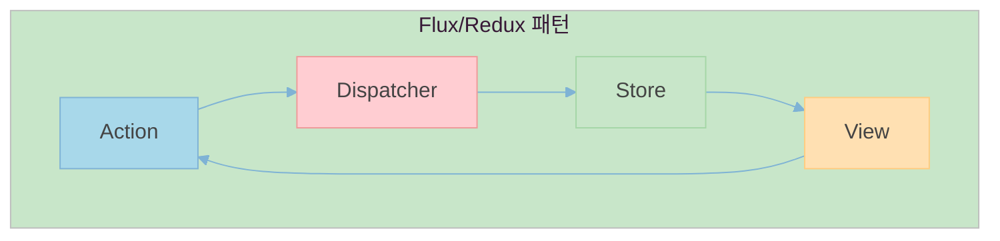
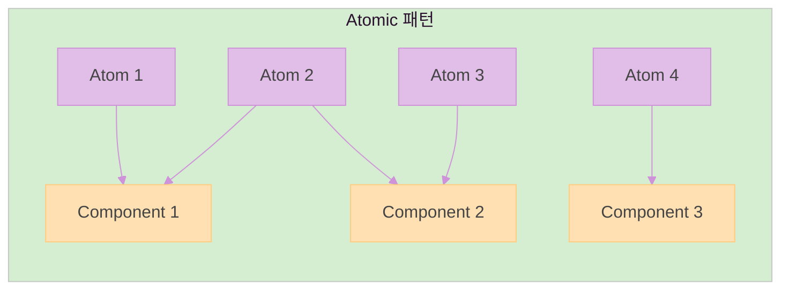
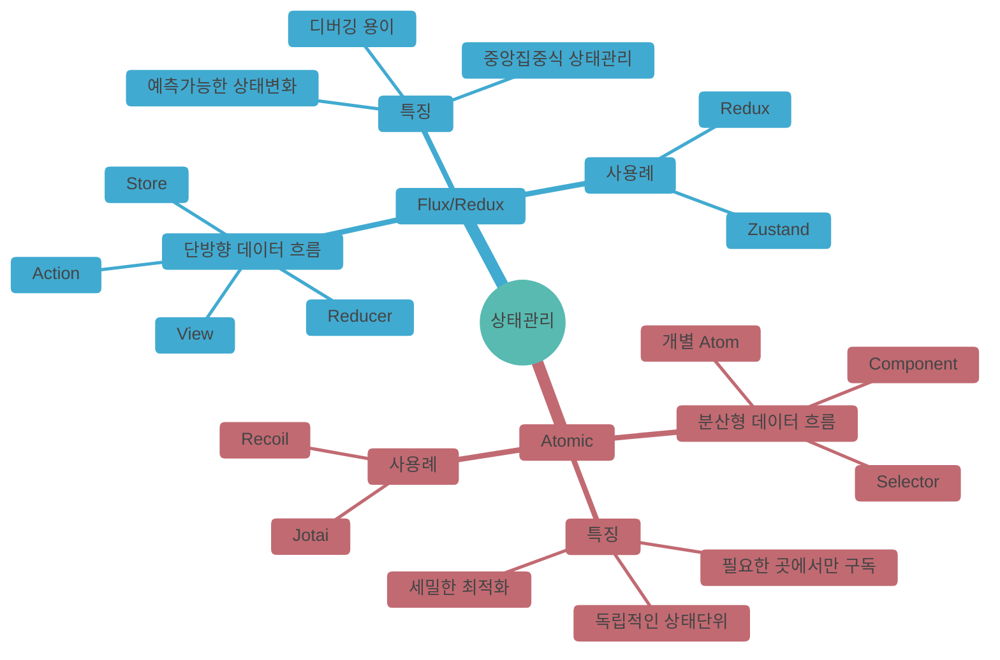
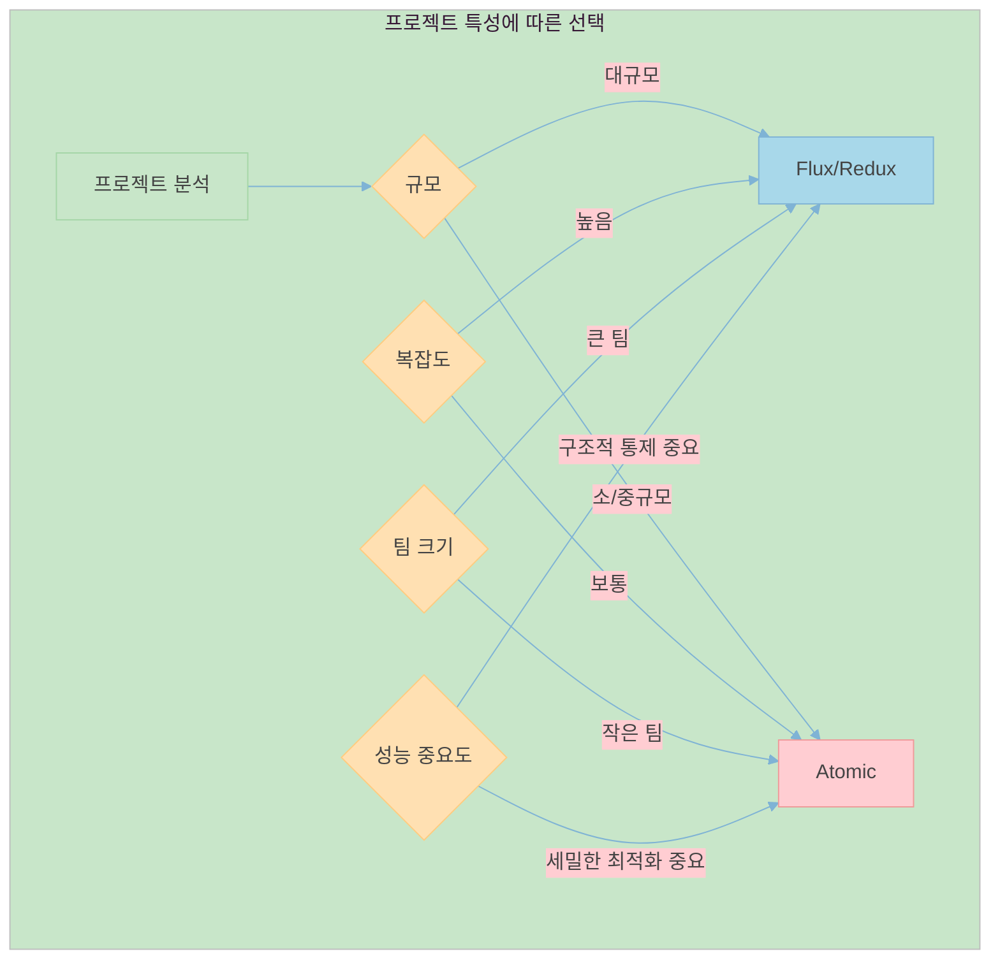

# 전역 상태관리 라이브러리 선택 시 고려사항

## 상태 관리 패러다임 비교

## 패러다임별 특징

## 선택 기준

## 리렌더링 최적화 관점

Zustand는 selector를 통한 상태 구독 범위 제한으로 불필요한 리렌더링 방지에 효과적이라고 알려져 있다. 그러나 이는 Jotai와 같은 atomic 패러다임을 따르는 라이브러리들도 동일하게 제공하는 특성으로, Zustand만의 고유한 장점이라고 보기는 어렵다.

## 구현상의 특징과 한계

다만, atomic 패러다임의 경우에도 구조적 통제가 가능하다. 그러나 이는 개발자들의 자발적이고 일관된 규칙 준수가 전제되어야 한다. 이러한 특성은 라이브러리의 한계라기보다는 JavaScript/TypeScript가 가지는 약타입 언어로서의 유연성에서 기인하는 특징이라고 볼 수 있다.
